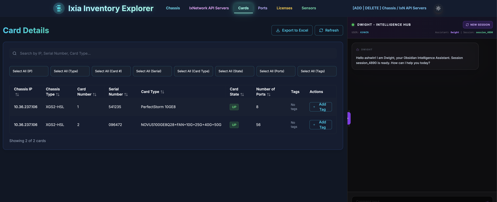
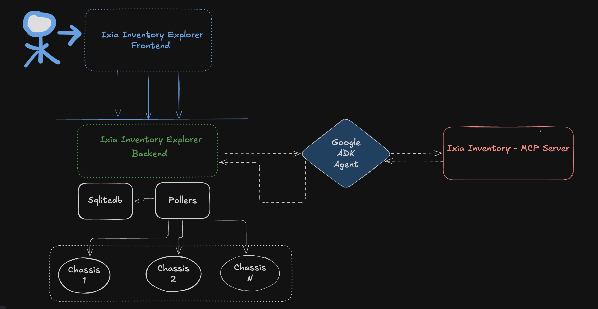

# Ixia Inventory Explorer v2.0

A modern web application for managing Ixia chassis inventory with FastAPI backend and React frontend.



---

## 📋 Table of Contents

- [Overview](#overview)
- [Features](#features)
- [Quick Start](#quick-start)
- [Architecture](#architecture)
- [Configuration](#configuration)
- [API Documentation](#api-documentation)
- [Development](#development)
- [Troubleshooting](#troubleshooting)

---

## 🎯 Overview

Ixia Inventory Explorer is a full-stack application that provides a unified interface for managing Ixia chassis inventory. The application features:

- **Backend**: FastAPI (Python 3.11+) with async database operations
- **Frontend**: React 18 + Vite + Tailwind CSS + shadcn/ui
- **Database**: SQLite with async support
- **Architecture**: RESTful API with Single Page Application (SPA)
- **Deployment**: Docker-ready with separate or combined container options

---

## ✨ Features

- ✅ Unified preview of available Ixia Chassis with custom tagging
- ✅ License statistics for every Ixia Chassis
- ✅ Card Statistics with custom tagging feature
- ✅ Port Statistics with owner and transceiver information
- ✅ Sensor readings and monitoring
- ✅ Performance metrics with real-time charts (CPU & Memory)
- ✅ One-click IxOS chassis log collection
- ✅ On-demand data refresh
- ✅ Advanced filtering and search capabilities
- ✅ Modern, responsive UI with blue-themed table headers
- ✅ "Last Polled at" timestamp display on all data views
- ✅ AI-powered chat assistant (via ADK agent)
- ✅ IxNetwork API Server session tracking

---

## 🚀 Quick Start

### Prerequisites

- **Docker** (Recommended): Docker Engine 20.10+ and Docker Compose
- **Local Development**: Python 3.11+, Node.js 18+, SQLite3
- **Network Access**: Access to Ixia chassis REST APIs

### Option 1: Docker (Recommended - Easiest)

**Using the rebuild script (recommended for development):**

```bash
# Clone the repository
git clone <repository-url>
cd ixiaInventoryExplorer

# Rebuild and start containers
./docker-rebuild.sh
```

**Using Docker Compose directly:**

```bash
# Start separate frontend + backend containers (development)
docker-compose -f docker-compose.separate.yml up -d

# Or start single combined container (production)
docker-compose -f docker-compose.combined.yml up -d
```

**Access the application:**
- **Frontend**: http://localhost:5174
- **Backend API**: http://localhost:3001
- **API Docs**: http://localhost:3001/docs

**Stop containers:**
```bash
docker-compose -f docker-compose.separate.yml down
```

### Option 2: Local Development

**Backend Setup:**

```bash
# Create virtual environment
python3 -m venv venv
source venv/bin/activate  # On Windows: venv\Scripts\activate

# Install dependencies
pip install -r requirements.txt

# Initialize database
python init_db.py

# Run FastAPI server
uvicorn main:app --reload --host 0.0.0.0 --port 3001
```

**Frontend Setup:**

```bash
# Install dependencies
npm install

# Start development server
npm run dev
```

**Access:**
- Backend: http://localhost:3001
- Frontend: http://localhost:5174

---

## 🏗️ Architecture



### Component Overview

The application consists of three main components:

1. **Ixia Inventory Explorer (Frontend + Backend)**
   - Web UI and REST APIs
   - Credentials management
   - Inventory data storage

2. **IxNetwork Session Management MCP** (Optional)
   - IxNetwork session lifecycle management
   - Runs on port 8888
   - Repository: `https://github.com/ashwinjo/ixnetwork-mcp`

3. **Ixia Inventory Explorer MCP Agent** (Optional)
   - AI-powered agent for inventory operations
   - Runs on port 8000
   - Repository: `https://github.com/ashwinjo/inventory-adk-agents`

### Docker Deployment Options

**Separate Containers (Development):**
- Frontend: Port 5174 (Vite dev server with hot reload)
- Backend: Port 3001 (FastAPI with background pollers)
- Use: `docker-compose.separate.yml`

**Combined Container (Production):**
- Single container: Port 8080 (Frontend + Backend)
- Use: `docker-compose.combined.yml`

### Data Persistence

Data is automatically persisted using Docker volumes:
- **Database**: `./data/inventory.db` (mounted from host)
- **Logs**: `./logs/` (optional, for production mode)

**Database Features:**
- SQLite with **WAL (Write-Ahead Logging) mode** enabled for better concurrency
- Automatic retry logic for database locking issues
- Data survives container restarts by default

**Clean Database Start:**
To start with a fresh database (removes all existing data):
```bash
CLEAN_DB_ON_START=true docker-compose -f docker-compose.separate.yml up -d
```

To reset data manually, remove the `./data` directory.

---

## ⚙️ Configuration

### Environment Variables

Create a `.env` file in the project root (optional):

```env
# Application Settings
PORT=3001
DEBUG=False
HOST=0.0.0.0

# Database
DATABASE_PATH=./data/inventory.db

# CORS Settings
CORS_ORIGINS=*

# ADK Agent URL (for AI chat features)
ADK_URL=http://host.docker.internal:8000

# Database Clean Start (optional)
# Set to true to remove existing database on container start
CLEAN_DB_ON_START=false

# Polling Intervals (seconds)
# Note: These environment variables are for reference only.
# Actual intervals are configured via UI or API and stored in database.
# Defaults if not configured:
CHASSIS_POLL_INTERVAL=60        # 1 minute
CARDS_POLL_INTERVAL=120         # 2 minutes
PORTS_POLL_INTERVAL=120         # 2 minutes
SENSORS_POLL_INTERVAL=180       # 3 minutes
PERF_POLL_INTERVAL=60           # 1 minute
LICENSING_POLL_INTERVAL=300     # 5 minutes
DATA_PURGE_INTERVAL=86400       # 24 hours
IXNETWORK_POLL_INTERVAL=60      # 1 minute
```

### Docker Environment Variables

**For separate containers (`docker-compose.separate.yml`):**
```bash
# Custom ports
FRONTEND_PORT=3000 BACKEND_PORT=8080 docker-compose -f docker-compose.separate.yml up -d

# Custom ADK URL
ADK_URL=http://your-adk-server:8000 docker-compose -f docker-compose.separate.yml up -d
```

**For combined container (`docker-compose.combined.yml`):**
```bash
# Custom port
PORT=9000 docker-compose -f docker-compose.combined.yml up -d
```

### Chassis Configuration

Upload chassis configuration via the Config page or API:

**CSV Format:**
```csv
ADD,192.168.1.100,admin,password
ADD,192.168.1.101,admin,password
DELETE,192.168.1.100,admin,password
```

**Operations:**
- `ADD` - Add a new chassis
- `DELETE` - Remove a chassis
- `UPDATE` - Update chassis credentials

---

## 📚 API Documentation

Once the backend is running, access interactive API documentation:

- **Swagger UI**: http://localhost:3001/docs
- **ReDoc**: http://localhost:3001/redoc

### Key API Endpoints

**Chassis:**
- `GET /api/chassis` - Get all chassis
- `POST /api/poll/chassis` - Poll latest chassis data

**Cards:**
- `GET /api/cards` - Get all cards
- `POST /api/poll/cards` - Poll latest card data

**Ports:**
- `GET /api/ports` - Get all ports
- `POST /api/poll/ports` - Poll latest port data

**Licenses:**
- `GET /api/licenses` - Get all licenses
- `POST /api/poll/licensing` - Poll latest license data

**Sensors:**
- `GET /api/sensors` - Get all sensors
- `POST /api/poll/sensors` - Poll latest sensor data

**IxNetwork API Servers:**
- `GET /api/ixnetwork` - Get IxNetwork API server sessions
- `POST /api/poll/ixnetwork` - Poll latest IxNetwork server data

**Performance:**
- `GET /api/performance/chassis-list` - Get chassis list for metrics
- `GET /api/performance/metrics/{ip}` - Get performance metrics

**Configuration:**
- `POST /api/config/upload` - Upload chassis configuration (CSV format)
- `POST /api/config/polling-intervals` - Set polling intervals (requires all 7 fields: `chassis`, `cards`, `ports`, `sensors`, `licensing`, `perf`, `purge`)
- `GET /api/config/chassis` - Get configured chassis list
- `GET /api/config/ixnetwork-servers` - Get configured IxNetwork API servers

**Tags:**
- `POST /api/tags/add` - Add tags to chassis/cards
- `POST /api/tags/remove` - Remove tags from chassis/cards

**Logs:**
- `POST /api/logs/collect` - Collect logs from chassis

**Health:**
- `GET /health` - Health check endpoint

---

## 💻 Development

### Project Structure

```
ixiaInventoryExplorer/
├── main.py                      # FastAPI application entry point
├── app/
│   ├── api/                     # API route handlers
│   ├── models/                   # Pydantic models
│   └── database.py              # Async database utilities
├── src/                         # React frontend
│   ├── components/              # React components
│   ├── pages/                   # Page components
│   ├── hooks/                   # Custom hooks
│   └── lib/                     # Utilities
├── data/                        # Database directory (created on first run)
├── docker-compose.separate.yml  # Separate containers setup
├── docker-compose.combined.yml  # Combined container setup
├── docker-rebuild.sh            # Quick rebuild script
└── requirements.txt             # Python dependencies
```

### Development Workflow

**Making code changes:**

1. Edit your code in `src/` (frontend) or `app/` (backend)
2. Run rebuild script:
   ```bash
   ./docker-rebuild.sh
   ```
3. Changes are automatically picked up (hot reload for frontend)

**View logs:**
```bash
# All services
docker-compose -f docker-compose.separate.yml logs -f

# Specific service
docker-compose -f docker-compose.separate.yml logs -f backend
docker-compose -f docker-compose.separate.yml logs -f frontend
```

### Background Polling

The application includes background polling services for automatic data collection. These run automatically in Docker containers.

#### Default Polling Intervals

| Poller Category | Default Interval | Description |
|----------------|------------------|-------------|
| **chassis** | 60 seconds (1 minute) | Chassis summary data |
| **cards** | 120 seconds (2 minutes) | Card details |
| **ports** | 120 seconds (2 minutes) | Port details |
| **sensors** | 180 seconds (3 minutes) | Sensor readings |
| **perf** | 60 seconds (1 minute) | Performance metrics (CPU/Memory) |
| **licensing** | 300 seconds (5 minutes) | License information |
| **data_purge** | 86400 seconds (24 hours) | Old data cleanup |
| **ixnetwork** | 60 seconds (1 minute) | IxNetwork API server sessions |

**Note:** These are the default intervals used when no custom intervals are configured. You can override them via the Config page in the UI or by calling the `/api/config/polling-intervals` API endpoint.

#### Starting Pollers Locally (Development)

For local development without Docker:

```bash
# Start polling processes with default intervals
python data_poller.py --category=chassis &
python data_poller.py --category=cards &
python data_poller.py --category=ports &
python data_poller.py --category=sensors &
python data_poller.py --category=perf &
python data_poller.py --category=licensing &
python data_poller.py --category=ixnetwork &

# Or with custom intervals
python data_poller.py --category=chassis --interval=120 &
```

#### Configuring Polling Intervals

Configure polling intervals via:
- **UI**: Go to Config page → Polling Settings section
- **API**: `POST /api/config/polling-intervals` with all 7 required fields:
  ```json
  {
    "chassis": 60,
    "cards": 120,
    "ports": 120,
    "sensors": 180,
    "licensing": 300,
    "perf": 60,
    "purge": 86400
  }
  ```

**Note:** All 7 fields (`chassis`, `cards`, `ports`, `sensors`, `licensing`, `perf`, `purge`) are required when setting polling intervals via API.

### Building for Production

**Frontend:**
```bash
npm run build
```

**Backend:**
The FastAPI application is ready for production. Use a production ASGI server:
```bash
uvicorn main:app --host 0.0.0.0 --port 3001 --workers 4
```

**Docker Production Build:**
```bash
docker-compose -f docker-compose.combined.yml up -d
```

---

## 🔧 Troubleshooting

### Backend Issues

**Port already in use:**
```bash
# Change port in docker-compose file or use custom port
BACKEND_PORT=9000 docker-compose -f docker-compose.separate.yml up -d
```

**Database errors:**
```bash
# Remove and recreate database
rm -rf data/
docker-compose -f docker-compose.separate.yml up -d
```

**Import errors:**
- Ensure virtual environment is activated (local development)
- Check that all dependencies are installed: `pip install -r requirements.txt`

### Frontend Issues

**API connection errors:**
- Verify backend is running: `curl http://localhost:3001/health`
- Check CORS configuration in backend
- Verify `VITE_BACKEND_URL` is set correctly

**Build errors:**
```bash
# Clear and reinstall dependencies
rm -rf node_modules package-lock.json
npm install
```

### Docker Issues

**Build failures:**
- Check Dockerfile syntax
- Verify all dependencies are available
- Try rebuilding without cache: `./docker-rebuild.sh --no-cache`

**Container won't start:**
```bash
# Check logs
docker-compose -f docker-compose.separate.yml logs

# Check container status
docker-compose -f docker-compose.separate.yml ps
```

**Permission errors:**
```bash
# Fix data directory permissions
chmod -R 755 data/
```

**Data not persisting:**
- Verify volume mounts in docker-compose file
- Check that `./data` directory exists on host
- Ensure `DATABASE_PATH` environment variable is set correctly

**Database locking errors:**
- The application includes automatic retry logic for SQLite locking issues
- Database uses WAL mode for better concurrency
- If persistent locking errors occur, check poller logs: `docker logs ixia-backend | grep -i "\[DB\]"`
- Consider reducing polling frequency if multiple pollers are causing conflicts

**Checking poller status:**
```bash
# Use the provided script to check poller status
./check-pollers.sh

# Or manually check poller processes
docker exec ixia-backend ps aux | grep data_poller

# View poller logs
docker logs ixia-backend | grep -i "\[POLL\]"
```

### ADK Agent Issues

**Chat assistant not working:**
- Verify ADK agent is running on port 8000
- Check `ADK_URL` environment variable
- For Docker: Use `http://host.docker.internal:8000` (Mac/Windows)
- Check backend logs for ADK connection errors

---

## 📖 Additional Resources

### REST API References

Ixia Chassis REST API documentation:
- `https://(chassisIp)/chassis/swagger/index.html`
- `https://(chassisIp)/platform/swagger/index.html`

Open IxOS APIs: https://github.com/OpenIxia/IxOS/tree/master/Utilities/Python

### Related Repositories

- **IxNetwork Session Management MCP**: https://github.com/ashwinjo/ixnetwork-mcp
- **Ixia Inventory Explorer MCP Agent**: https://github.com/ashwinjo/inventory-adk-agents

### Documentation

- [Project Structure](docs/PROJECT_STRUCTURE.md)
- [Docker Deployment Guide](docs/DOCKER_DEPLOYMENT_GUIDE.md)
- [ADK Configuration](ADK_CONFIGURATION.md)

---

## 🤝 Contributing

This project is maintained by Keysight Technologies. For feedback or issues, please contact: ashwin.joshi@keysight.com

---

## 📄 License

See [LICENSE](LICENSE) file for details.

---

## ⚠️ Disclaimer

This Python-based tool is provided as-is, without any warranty or guarantee of fitness for any particular purpose. The authors provide no support for feature requests, bug fixes, or modifications. However, users are welcome to modify the code for their own use.

---

## 📝 Version History

- **v2.0.1** - Latest updates:
  - Added WAL mode for SQLite database (improved concurrency)
  - Added `CLEAN_DB_ON_START` option for fresh database starts
  - Added "Last Polled at" timestamp display on all data views
  - Updated table headers to match navbar blue color scheme
  - Added IxNetwork API Server poller
  - Fixed polling intervals API (added `perf` and `purge` fields)
  - Improved database error handling with retry logic
- **v2.0.0** - Migrated to FastAPI with React frontend
- **v1.0.0** - Original Flask-based version

---

## 🚀 Quick Reference

| Component | Port | Purpose |
|-----------|------|---------|
| Frontend | 5174 | Web UI for inventory exploration |
| Backend API | 3001 | REST APIs, credentials, config |
| API Docs | 3001/docs | Interactive API documentation |
| Health Check | 3001/health | Service health status |

**Common Commands:**

```bash
# Start services
./docker-rebuild.sh

# View logs
docker-compose -f docker-compose.separate.yml logs -f

# Stop services
docker-compose -f docker-compose.separate.yml down

# Rebuild without cache
./docker-rebuild.sh --no-cache
```
